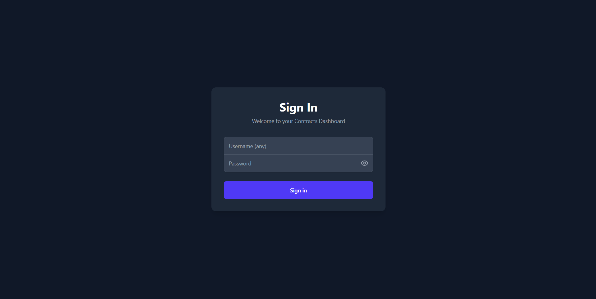
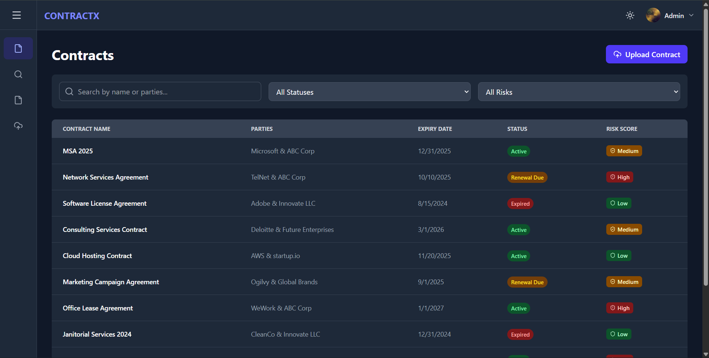
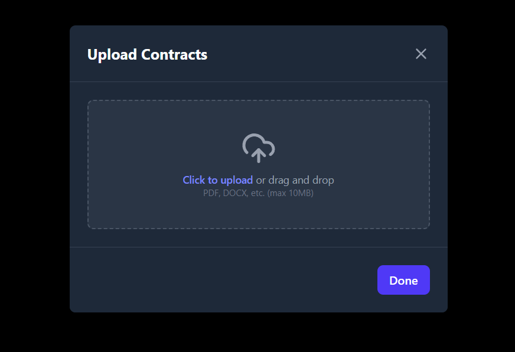

SaaS Contracts Management Dashboard
A responsive single-page application built with React and Tailwind CSS that provides a clean and modern interface for managing SaaS contracts. This dashboard simulates features like user authentication, contract viewing, filtering, and AI-powered insights.

LINK:-https://saas-contracts-dashboard-zeta.vercel.app/

Features
Secure Mock Authentication: A clean login interface that accepts test123 as the password for any username.

Dynamic Contracts Dashboard:

View, search, and filter a list of contracts fetched from a mock API.

Client-side pagination to handle large datasets gracefully.

Real-time search by contract name or parties.

Advanced filtering by contract status and risk level.

Detailed Contract View: Click on any contract to navigate to a detailed page showing key clauses, metadata, and AI-driven insights.

Evidence Drawer: A slide-in panel to view evidence snippets related to contract clauses without losing context.

Simulated File Upload: An intuitive drag-and-drop modal to simulate uploading new contract files.

Collapsible Sidebar Navigation: A modern, icon-based sidebar that expands on demand.

Light & Dark Mode: A sleek theme toggle that persists the user's preference in localStorage.

Fully Responsive: The layout is optimized for a seamless experience on both desktop and mobile devices.

Tech Stack & Decisions
React: The core of the application, built entirely with functional components and modern hooks for efficient state management and component lifecycle control.

Tailwind CSS: A utility-first CSS framework used for all styling. It enables rapid development of a custom, responsive design system. Dark mode is implemented using Tailwind's class strategy.

Vite: The build tool of choice for its lightning-fast Hot Module Replacement (HMR) and optimized build process, providing a superior development experience.

React Context API: Used for global state management (Theme and Authentication), offering a lightweight and built-in solution without the need for external libraries like Redux.

Lucide React: For a comprehensive and consistent set of beautiful icons.

Local Development Setup
Follow these steps to get the project running on your local machine.

Prerequisites
Node.js (v18.0 or higher)

npm (v9.0 or higher)

Installation
Clone the repository:

git clone [https://github.com/GitH22Ash/saas-contracts-dashboard.git](https://github.com/GitH22Ash/saas-contracts-dashboard.git)

Navigate to the project directory:

cd your-repo-name

Install the dependencies:

npm install

Running the Project
Start the development server:

npm run dev

Open your browser and go to http://localhost:5173 (or the URL provided in your terminal).
